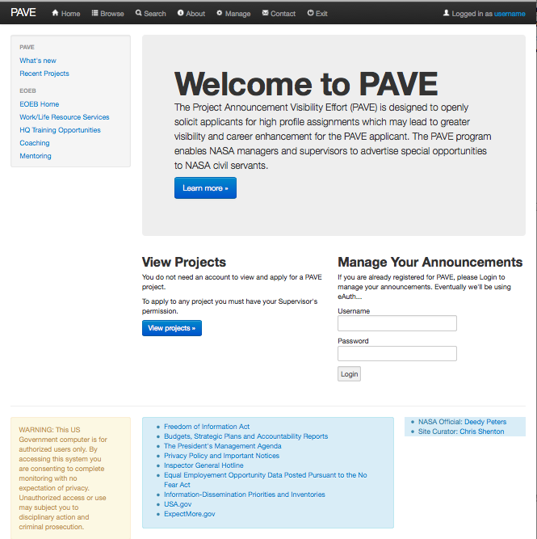
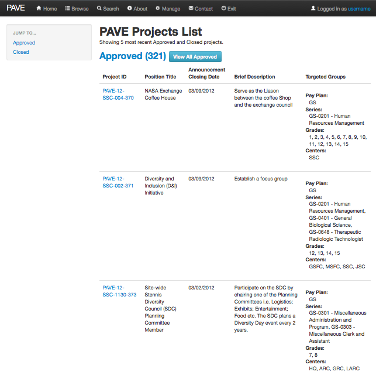
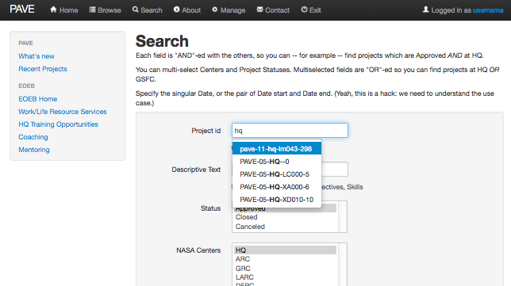
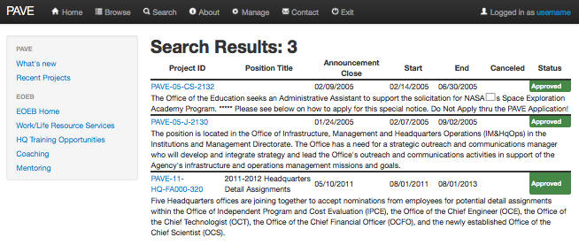
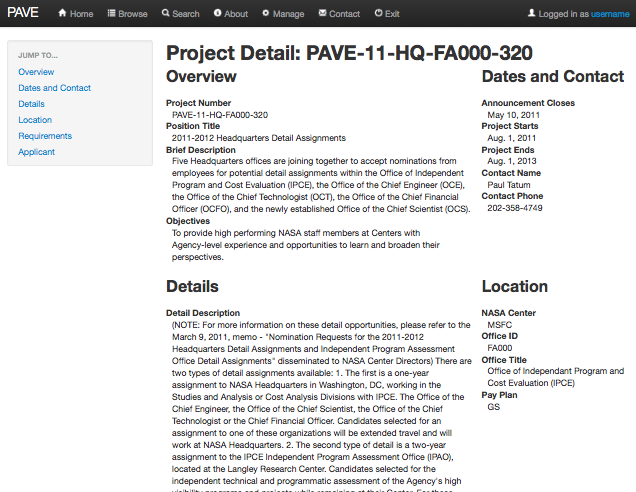
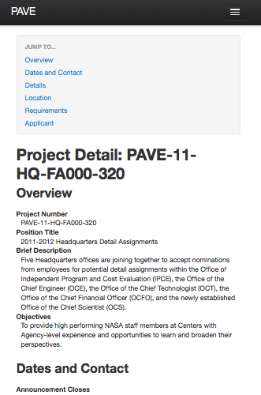

===================================
 PAVE: New Implementation Benefits
===================================

2012-04-11 Chris.Shenton@nasa.gov

This "leave-behind" highlights some of the features and benefits of a
new implementation based on modern open-source technology.

Core Technology
===============

The technologies used in this prototype are all open source, allowing
reduced cost and access to best-of-breed modern features, as well as
opening up development to a larger pool of contemporary developers.

Django Framework
----------------

Built on top of the very popular Django web application framework,
widely deployed at large enterprises including government agencies and
private organizations such as Washington Post, Discover Channel, PBS.

Allows rapid application development as the common features needed by
web apps are built in: database access and modeling, views, templates
and forms.

Business logic is kept out of the HTML templates which greatly
enhances maintainability.

The application platform is well known by many developers so access to
qualified programmers is increased.

Django's open source status allows it to grow quickly and has a rich
ecosystem of third party plugins.

Since the framework provides so much functionality, the code required
for the business logic is reduced making it faster to develop new
features and also for code maintenance.  The prototype you see here
took only 4 days to develop.

Data Base
---------

Can use the open source databases SQLite, MySQL, PostgreSQL, or
commercial products from Oracle and MicroSoft.

The SQLite database can be "server-less" allowing reduced load on the server.

Bootstrap Web UI
----------------

The Bootstrap web user interface framework was donated to the open
source community by Twitter.  It allows us to build attractive,
functional web sites with greatly reduced effort to hand-coding the UI
from scratch.  Of course it can be extended and customized for local
needs.

Bootstrap provides a "responsive" user interface, meaning that it
gracefully re-formats for smaller displays such as tablet and phone.
This makes the application accessible on a wide range of devices with
an excellent mobile experience, at no additional development cost.

Documentation
-------------

The Sphinx documentation system allows developers to keep technical
documentation in sync with actual code, and is rendered into
attractive, hyperlinked HTML pages or even PDF.

Functionality
=============

Current prototype functionality was limited by what was exposed as a
public user, browsing the project opportunities, so there is back-end
functionality that has not yet been explored.

Look-n-Feel
-----------

The user interface has been streamlined and modeled after modern "Web
2.0" sites.

Responsive
----------

Response time for the user is excellent.

Layout
------

Browse and search results are formatted similarly to the existing
implementation but can easily be changed to be more easily readable
and consistent across search/browse functions.  Modern features like
in-browser table sorting can be added with very little work.

Improved Search
---------------

An auto-suggest feature has been added to more easily search by
Project Number.

A Text search box has been added which searches project Title, Short
Description, Long Description, Opportunities and Skills.

These make it much easier to find opportunities.

Screen Shots
============

Home
----

Clean "Web-2.0" look, which can be customized. Note the persistent
Google-like menu bar at the top.

Browse
------

Project overview is uncluttered, and maintains a consistent
look-n-feel throughout the site.

Search with Auto-Complete
-------------------------

Auto-completion makes searching by Project Name easy.  Text can be
searched in the Title, Descriptions, Objectives and Skills fields.

Search Results
--------------

Search is quick; the format can be changed easily -- for example to
make it more consistent with the Browse overview.

Project Details
---------------

Details are grouped by topic, in an uncluttered two-column layout.

Project Details: Mobile View
----------------------------

Notice how the information has been re-stacked, with a table of
contents allowing mobile users to quickly jump to the section in which
they are interested.

